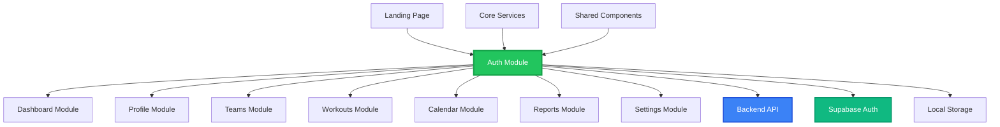

# 🔗 Dependencias y Módulos - Autenticación PlanSport

> Documentación completa de las dependencias, integraciones y relaciones del módulo de autenticación con otros componentes del sistema PlanSport.

---

## 🎯 Resumen de Dependencias

El módulo de autenticación actúa como el **núcleo de seguridad** de PlanSport, proporcionando servicios de autenticación y autorización a todos los demás módulos del sistema.

### 📊 Mapa de Dependencias



---

## 🏗️ Dependencias Técnicas

### 📦 Dependencias NPM

#### Dependencias Principales
```json
{
  "dependencies": {
    "@angular/core": "^20.1.0",
    "@angular/common": "^20.1.0",
    "@angular/router": "^20.1.0",
    "@angular/forms": "^20.1.0",
    "@angular/platform-browser": "^20.1.0",
    "lucide-angular": "^0.468.0",
    "tailwindcss": "^4.1.12"
  }
}
```

#### Dependencias de Desarrollo
```json
{
  "devDependencies": {
    "@angular/testing": "^20.1.0",
    "jasmine": "^5.0.0",
    "karma": "^6.4.0",
    "cypress": "^13.0.0",
    "@types/node": "^20.0.0"
  }
}
```

### 🔧 Servicios Core Requeridos

#### NotificationService (Requerido)
```typescript
// Interfaz esperada por el módulo de autenticación
export interface INotificationService {
  success(message: string, options?: NotificationOptions): void;
  error(message: string, options?: NotificationOptions): void;
  warning(message: string, options?: NotificationOptions): void;
  info(message: string, options?: NotificationOptions): void;
}

// Implementación sugerida
@Injectable({
  providedIn: 'root'
})
export class NotificationService implements INotificationService {
  success(message: string, options?: NotificationOptions): void {
    // Implementar toast de éxito
  }
  
  error(message: string, options?: NotificationOptions): void {
    // Implementar toast de error
  }
}
```

#### LoadingService (Opcional)
```typescript
export interface ILoadingService {
  show(message?: string): void;
  hide(): void;
  isLoading(): boolean;
}
```

---

## 🔄 Integraciones con Módulos

### 🏠 Landing Page Module

**Tipo de Dependencia**: Consumidor
**Relación**: La landing page consume servicios de autenticación

#### Integración Requerida
```typescript
// landing.component.ts
@Component({
  selector: 'app-landing',
  standalone: true,
  imports: [CommonModule, RouterModule],
  template: `
    <header class="landing-header">
      <nav class="flex justify-between items-center">
        <div class="logo">
          
        </div>
        
        <div class="auth-buttons" *ngIf="!authService.isAuthenticated(); else userMenu">
          <button 
            class="btn-secondary mr-4"
            (click)="navigateToAuth('login')"
          >
            Iniciar Sesión
          </button>
          <button 
            class="btn-primary"
            (click)="navigateToAuth('register')"
          >
            Registrarse
          </button>
        </div>
        
        <ng-template #userMenu>
          <div class="user-menu">
            <span>Hola, {{ authService.currentUser()?.fullName }}</span>
            <button (click)="goToDashboard()" class="btn-primary ml-4">
              Dashboard
            </button>
          </div>
        </ng-template>
      </nav>
    </header>
  `
})
export class LandingComponent {
  authService = inject(AuthService);
  router = inject(Router);
  
  navigateToAuth(tab: 'login' | 'register'): void {
    this.router.navigate(['/auth'], { queryParams: { tab } });
  }
  
  goToDashboard(): void {
    this.router.navigate(['/dashboard']);
  }
}
```

**Archivos a Modificar**:
- `src/app/pages/landing/landing.component.ts`
- `src/app/pages/landing/landing.component.html`
- `src/app/pages/landing/landing.component.scss`

### 📊 Dashboard Module

**Tipo de Dependencia**: Consumidor Protegido
**Relación**: Dashboard requiere autenticación válida

#### Guard Integration
```typescript
// dashboard.routes.ts
export const dashboardRoutes: Routes = [
  {
    path: '',
    component: DashboardComponent,
    canActivate: [AuthGuard], // ← Dependencia del Auth Module
    children: [
      {
        path: 'profile',
        loadComponent: () => import('./profile/profile.component')
          .then(c => c.ProfileComponent),
        canActivate: [AuthGuard]
      },
      {
        path: 'teams',
        loadComponent: () => import('./teams/teams.component')
          .then(c => c.TeamsComponent),
        canActivate: [AuthGuard, RoleGuard],
        data: { roles: ['admin', 'coach'] }
      }
    ]
  }
];
```

#### User Context Integration
```typescript
// dashboard.component.ts
@Component({
  selector: 'app-dashboard',
  template: `
    <div class="dashboard-layout">
      <aside class="sidebar">
        <div class="user-info">
          
          <h3>{{ currentUser()?.fullName }}</h3>
          <p class="text-sm text-gray-500">{{ currentUser()?.role | titlecase }}</p>
        </div>
        
        <nav class="sidebar-nav">
          <!-- Navegación basada en rol -->
          <a *ngIf="hasRole(['admin', 'coach'])" routerLink="/teams">Equipos</a>
          <a *ngIf="hasRole(['coach', 'athlete'])" routerLink="/workouts">Entrenamientos</a>
        </nav>
      </aside>
      
      <main class="main-content">
        <router-outlet></router-outlet>
      </main>
    </div>
  `
})
export class DashboardComponent {
  private authService = inject(AuthService);
  
  currentUser = this.authService.currentUser;
  
  userAvatar = computed(() => {
    const user = this.currentUser();
    return user?.metadata?.avatar || '/assets/default-avatar.svg';
  });
  
  hasRole(roles: string[]): boolean {
    const userRole = this.currentUser()?.role;
    return userRole ? roles.includes(userRole) : false;
  }
}
```

### 👤 Profile Module

**Tipo de Dependencia**: Consumidor y Colaborador
**Relación**: Gestiona datos del usuario autenticado

#### Profile Service Integration
```typescript
// profile.service.ts
@Injectable({
  providedIn: 'root'
})
export class ProfileService {
  private authService = inject(AuthService);
  private http = inject(HttpClient);
  
  async updateProfile(profileData: UpdateProfileRequest): Promise<AuthUser> {
    const response = await firstValueFrom(
      this.http.put<AuthUser>('/auth/profile', profileData)
    );
    
    // Actualizar usuario en AuthService
    this.authService.updateCurrentUser(response);
    
    return response;
  }
  
  async changePassword(passwordData: ChangePasswordRequest): Promise<void> {
    await firstValueFrom(
      this.http.post('/auth/change-password', passwordData)
    );
  }
}
```

### 👥 Teams Module

**Tipo de Dependencia**: Consumidor con Autorización
**Relación**: Requiere roles específicos para acceso

#### Role-Based Access
```typescript
// teams.component.ts
@Component({
  selector: 'app-teams',
  template: `
    <div class="teams-container">
      <header class="teams-header">
        <h1>Gestión de Equipos</h1>
        <button 
          *ngIf="canCreateTeams()"
          class="btn-primary"
          (click)="createTeam()"
        >
          Crear Equipo
        </button>
      </header>
      
      <div class="teams-grid">
        <div *ngFor="let team of teams()" class="team-card">
          <h3>{{ team.name }}</h3>
          <p>{{ team.description }}</p>
          
          <div class="team-actions" *ngIf="canManageTeam(team)">
            <button (click)="editTeam(team)">Editar</button>
            <button (click)="deleteTeam(team)">Eliminar</button>
          </div>
        </div>
      </div>
    </div>
  `
})
export class TeamsComponent {
  private authService = inject(AuthService);
  
  currentUser = this.authService.currentUser;
  teams = signal<Team[]>([]);
  
  canCreateTeams(): boolean {
    const role = this.currentUser()?.role;
    return role === 'admin' || role === 'coach';
  }
  
  canManageTeam(team: Team): boolean {
    const user = this.currentUser();
    if (!user) return false;
    
    return user.role === 'admin' || 
           (user.role === 'coach' && team.coachId === user.id);
  }
}
```

---

## 🔒 Dependencias de Seguridad

### 🛡️ Guards Compartidos

Los guards del módulo de autenticación son utilizados por otros módulos:

```typescript
// Ejemplo de uso en otros módulos
const protectedRoutes: Routes = [
  {
    path: 'admin',
    loadChildren: () => import('./admin/admin.routes'),
    canActivate: [AuthGuard, RoleGuard],
    data: { roles: ['admin'] }
  },
  {
    path: 'coach',
    loadChildren: () => import('./coach/coach.routes'),
    canActivate: [AuthGuard, RoleGuard],
    data: { roles: ['admin', 'coach'] }
  },
  {
    path: 'athlete',
    loadChildren: () => import('./athlete/athlete.routes'),
    canActivate: [AuthGuard, RoleGuard],
    data: { roles: ['admin', 'coach', 'athlete'] }
  }
];
```

### 🔄 Interceptors Globales

Los interceptors del módulo de autenticación afectan a toda la aplicación:

```typescript
// app.config.ts
export const appConfig: ApplicationConfig = {
  providers: [
    // ... otros providers
    {
      provide: HTTP_INTERCEPTORS,
      useClass: AuthInterceptor,
      multi: true
    },
    {
      provide: HTTP_INTERCEPTORS,
      useClass: ErrorInterceptor,
      multi: true
    },
    {
      provide: HTTP_INTERCEPTORS,
      useClass: TokenRefreshInterceptor,
      multi: true
    }
  ]
};
```

---

## 🌐 Dependencias Backend

### 🔌 API Endpoints Requeridos

El módulo de autenticación requiere que el backend exponga estos endpoints:

```typescript
// Endpoints mínimos requeridos
interface RequiredAuthEndpoints {
  // Autenticación básica
  'POST /auth/login': (body: LoginRequest) => AuthResponse;
  'POST /auth/register': (body: RegisterRequest) => AuthResponse;
  'POST /auth/logout': (body: { refreshToken: string }) => void;
  
  // Gestión de tokens
  'POST /auth/refresh': (body: RefreshTokenRequest) => AuthResponse;
  
  // Gestión de perfil
  'GET /auth/profile': () => AuthUser;
  'PUT /auth/profile': (body: UpdateProfileRequest) => AuthUser;
  
  // Recuperación de contraseña
  'POST /auth/forgot-password': (body: { email: string }) => void;
  'POST /auth/reset-password': (body: ResetPasswordRequest) => void;
  
  // Validaciones
  'POST /auth/check-email': (body: { email: string }) => { exists: boolean };
}
```

### 🔧 Configuración de CORS

```csharp
// Startup.cs o Program.cs (Backend .NET)
public void ConfigureServices(IServiceCollection services)
{
    services.AddCors(options =>
    {
        options.AddPolicy("AllowAngularApp", builder =>
        {
            builder
                .WithOrigins("http://localhost:4200", "https://planSport.com")
                .AllowAnyMethod()
                .AllowAnyHeader()
                .AllowCredentials();
        });
    });
}
```

### 📊 Base de Datos

#### Tablas Requeridas
```sql
-- Usuarios (ya existe)
CREATE TABLE Users (
    Id UNIQUEIDENTIFIER PRIMARY KEY,
    Email NVARCHAR(255) UNIQUE NOT NULL,
    FullName NVARCHAR(255) NOT NULL,
    PasswordHash NVARCHAR(255) NOT NULL,
    Role NVARCHAR(50) NOT NULL,
    OrganizationId UNIQUEIDENTIFIER NULL,
    EmailConfirmed BIT DEFAULT 0,
    Metadata NVARCHAR(MAX) NULL, -- JSON
    CreatedAt DATETIME2 DEFAULT GETUTCDATE(),
    UpdatedAt DATETIME2 DEFAULT GETUTCDATE()
);

-- Tokens de refresh
CREATE TABLE RefreshTokens (
    Id UNIQUEIDENTIFIER PRIMARY KEY,
    UserId UNIQUEIDENTIFIER NOT NULL,
    Token NVARCHAR(255) NOT NULL,
    ExpiresAt DATETIME2 NOT NULL,
    CreatedAt DATETIME2 DEFAULT GETUTCDATE(),
    RevokedAt DATETIME2 NULL,
    FOREIGN KEY (UserId) REFERENCES Users(Id)
);
```

---

## 📱 Dependencias de Estado

### 🔄 Estado Global Compartido

El AuthService proporciona estado global que otros módulos consumen:

```typescript
// Ejemplo de consumo en otros servicios
@Injectable({
  providedIn: 'root'
})
export class TeamsService {
  private authService = inject(AuthService);
  private http = inject(HttpClient);
  
  // El servicio automáticamente incluye el contexto del usuario
  getMyTeams(): Observable<Team[]> {
    const userId = this.authService.currentUser()?.id;
    if (!userId) {
      throw new Error('Usuario no autenticado');
    }
    
    return this.http.get<Team[]>(`/teams/user/${userId}`);
  }
  
  // Filtrado automático basado en organización
  getOrganizationTeams(): Observable<Team[]> {
    const orgId = this.authService.currentUser()?.organizationId;
    if (!orgId) {
      return of([]);
    }
    
    return this.http.get<Team[]>(`/teams/organization/${orgId}`);
  }
}
```

### 📊 Signals Compartidos

```typescript
// Otros módulos pueden crear computed signals basados en auth
@Injectable({
  providedIn: 'root'
})
export class PermissionsService {
  private authService = inject(AuthService);
  
  // Computed signals que reaccionan a cambios de autenticación
  canManageUsers = computed(() => {
    const user = this.authService.currentUser();
    return user?.role === 'admin';
  });
  
  canCreateWorkouts = computed(() => {
    const user = this.authService.currentUser();
    return user?.role === 'admin' || user?.role === 'coach';
  });
  
  canViewReports = computed(() => {
    const user = this.authService.currentUser();
    return user?.role !== 'viewer';
  });
}
```

---

## 🔧 Configuración de Entorno

### 🌍 Variables de Entorno

```typescript
// environment.ts
export const environment = {
  production: false,
  apiUrl: 'https://localhost:7001/api',
  
  // Configuración de autenticación
  auth: {
    tokenKey: 'planSport_accessToken',
    refreshTokenKey: 'planSport_refreshToken',
    tokenExpiryKey: 'planSport_tokenExpiry',
    
    // Tiempo antes de expiración para refresh automático (minutos)
    refreshThreshold: 5,
    
    // Tiempo de inactividad antes de logout automático (minutos)
    inactivityTimeout: 30,
    
    // Intentos máximos de login
    maxLoginAttempts: 5,
    
    // Tiempo de bloqueo después de intentos fallidos (minutos)
    lockoutDuration: 15
  },
  
  // URLs de redirección
  redirectUrls: {
    afterLogin: '/dashboard',
    afterLogout: '/',
    afterRegister: '/dashboard',
    unauthorized: '/auth?tab=login'
  }
};
```

### 🔒 Configuración de Producción

```typescript
// environment.prod.ts
export const environment = {
  production: true,
  apiUrl: 'https://api.planSport.com/api',
  
  auth: {
    // Configuración más estricta para producción
    refreshThreshold: 2,
    inactivityTimeout: 15,
    maxLoginAttempts: 3,
    lockoutDuration: 30
  }
};
```

---

## 📋 Checklist de Integración

### ✅ Pre-requisitos

- [ ] **Backend API**: Endpoints de autenticación implementados y funcionando
- [ ] **Base de Datos**: Tablas de usuarios y tokens creadas
- [ ] **CORS**: Configurado correctamente para permitir requests del frontend
- [ ] **HTTPS**: Certificados SSL configurados para producción
- [ ] **Variables de Entorno**: Configuradas para todos los ambientes

### 🔧 Servicios Core

- [ ] **NotificationService**: Implementado para mostrar mensajes al usuario
- [ ] **LoadingService**: (Opcional) Para estados de carga globales
- [ ] **LoggingService**: (Opcional) Para logs de seguridad
- [ ] **AnalyticsService**: (Opcional) Para tracking de eventos

### 🏗️ Módulos Dependientes

- [ ] **Landing Page**: Botones de login/registro implementados
- [ ] **Dashboard**: Guards aplicados y contexto de usuario integrado
- [ ] **Profile**: Servicios de actualización de perfil integrados
- [ ] **Teams**: Autorización basada en roles implementada
- [ ] **Workouts**: Guards y permisos configurados
- [ ] **Calendar**: Contexto de usuario aplicado
- [ ] **Reports**: Filtros por organización/usuario implementados
- [ ] **Settings**: Gestión de cuenta integrada

### 🔒 Seguridad

- [ ] **Guards**: Aplicados a todas las rutas protegidas
- [ ] **Interceptors**: Configurados globalmente
- [ ] **Token Management**: Refresh automático implementado
- [ ] **Error Handling**: Manejo de errores 401/403 configurado
- [ ] **Logout**: Limpieza completa de estado implementada

### 🧪 Testing

- [ ] **Unit Tests**: Servicios y componentes de auth testeados
- [ ] **Integration Tests**: Flujos completos de login/registro
- [ ] **E2E Tests**: Navegación y protección de rutas
- [ ] **Security Tests**: Validación de tokens y permisos

---

## 🚨 Riesgos y Mitigaciones

### ⚠️ Riesgos Identificados

1. **Incompatibilidad de API**
   - **Riesgo**: DTOs del frontend no coinciden con backend
   - **Mitigación**: Validar interfaces antes de implementar
   - **Responsable**: Desarrollador Frontend + Backend

2. **Problemas de CORS**
   - **Riesgo**: Requests bloqueados por política CORS
   - **Mitigación**: Configurar proxy en desarrollo, CORS en producción
   - **Responsable**: DevOps + Backend

3. **Tokens Expirados**
   - **Riesgo**: Usuarios deslogueados inesperadamente
   - **Mitigación**: Refresh automático con margen de seguridad
   - **Responsable**: Desarrollador Frontend

4. **Estado Inconsistente**
   - **Riesgo**: Estado de autenticación desincronizado entre módulos
   - **Mitigación**: Usar Signals y servicios centralizados
   - **Responsable**: Arquitecto Frontend

5. **Dependencias Circulares**
   - **Riesgo**: Módulos que se importan mutuamente
   - **Mitigación**: Arquitectura clara con servicios compartidos
   - **Responsable**: Arquitecto Frontend

### 🛡️ Plan de Contingencia

1. **Fallback de Autenticación**
   - Implementar modo "guest" para funcionalidades básicas
   - Almacenamiento local de datos críticos

2. **Recuperación de Estado**
   - Mecanismo de re-sincronización automática
   - Validación periódica de tokens

3. **Degradación Gradual**
   - Funcionalidades core disponibles sin autenticación
   - Mensajes claros sobre limitaciones

---

## 📈 Métricas de Dependencias

### 📊 KPIs de Integración

- **Tiempo de Carga**: < 2s para inicialización de auth
- **Tasa de Error**: < 1% en requests de autenticación
- **Disponibilidad**: > 99.9% uptime del servicio
- **Latencia**: < 500ms para operaciones de auth

### 🔍 Monitoreo

```typescript
// Ejemplo de métricas a trackear
interface AuthMetrics {
  loginAttempts: number;
  loginSuccesses: number;
  loginFailures: number;
  registrationAttempts: number;
  registrationSuccesses: number;
  tokenRefreshes: number;
  logouts: number;
  sessionDuration: number;
}
```

---

## 🔄 Versionado y Compatibilidad

### 📋 Matriz de Compatibilidad

| Auth Module | Angular | Backend API | Database |
|-------------|---------|-------------|----------|
| v1.0.0      | 20.x    | v1.0.x      | v1.0     |
| v1.1.0      | 20.x    | v1.1.x      | v1.0     |
| v2.0.0      | 21.x    | v2.0.x      | v2.0     |

### 🔄 Estrategia de Migración

1. **Backward Compatibility**: Mantener compatibilidad por 2 versiones
2. **Deprecation Warnings**: Avisos 1 versión antes de breaking changes
3. **Migration Guides**: Documentación detallada para actualizaciones
4. **Feature Flags**: Activación gradual de nuevas funcionalidades

---

*🔗 Documentación de dependencias creada para PlanSport - Módulo de Autenticación*
*Actualizado: Enero 2025*
*Versión: 1.0*