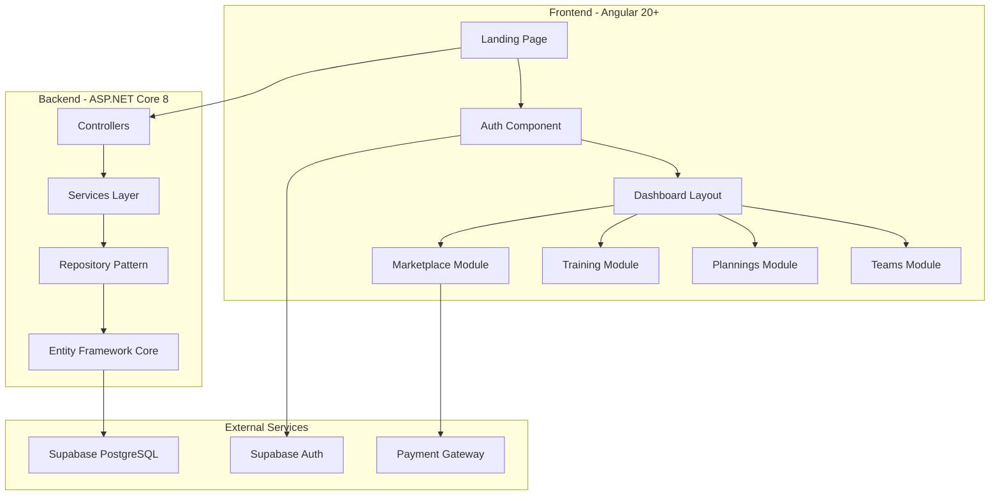

# SportPlanner - Arquitectura Técnica

## 🏗️ Vista General de la Arquitectura

SportPlanner implementa una arquitectura **full-stack moderna** con separación clara entre frontend, backend y servicios externos, optimizada para **escalabilidad multi-tenant** y **colaboración en tiempo real**.



## 🎨 Frontend Architecture (Angular 20+)

### **Core Technologies**
- **Framework**: Angular 20+ con Standalone Components
- **Styling**: Tailwind CSS 4.1
- **SSR**: Angular Universal habilitado
- **State Management**: Angular Signals + Services
- **HTTP Client**: Interceptors para autenticación

### **Modular Structure**
```
src/app/
├── core/                    # Servicios singleton y configuración
│   ├── auth/               # Autenticación con Supabase
│   ├── guards/             # Route guards (auth, subscription, role-based)
│   ├── interceptors/       # HTTP interceptors (auth, error handling)
│   └── services/           # Servicios compartidos globales
├── shared/                 # Componentes y utilidades reutilizables
│   ├── components/         # UI components (modals, forms, buttons)
│   ├── directives/         # Directivas personalizadas
│   ├── pipes/             # Pipes de transformación de datos
│   └── models/            # Interfaces y tipos TypeScript
├── features/              # Módulos funcionales por dominio
│   ├── auth/              # Login, register, subscription
│   ├── teams/             # Gestión de equipos
│   ├── plannings/         # Planificaciones y conceptos
│   ├── trainings/         # Entrenamientos y ejecución
│   ├── marketplace/       # Marketplace de planificaciones
│   └── dashboard/         # Dashboard principal y navegación
└── layout/               # Componentes de layout (navbar, sidebar)
```

### **Patterns y Arquitectura Frontend**

#### **🔐 Authentication Flow**
```typescript
// Flujo de autenticación integrado con Supabase
AuthService → Supabase Auth → JWT Token → Local Storage
     ↓
AuthInterceptor → Add Bearer Token → API Calls
     ↓
AuthGuard → Verify Token → Route Protection
```

#### **🛡️ Route Guards Strategy**
- **AuthGuard**: Verifica autenticación válida
- **SubscriptionGuard**: Controla acceso por tipo de suscripción
- **RoleGuard**: Permisos granulares por equipo/planificación
- **GuestGuard**: Redirige usuarios autenticados

#### **📱 Responsive Design System**
```css
/* Tailwind CSS Configuration */
- Mobile First: sm (640px+)
- Tablet: md (768px+) 
- Desktop: lg (1024px+)
- Large: xl (1280px+)
```

## 🔧 Backend Architecture (ASP.NET Core 8)

### **Layered Architecture**
```
SportPlanner.API/
├── Controllers/           # API endpoints y validación de entrada
├── Services/             # Lógica de negocio y orquestación
├── Repositories/         # Acceso a datos con Entity Framework
├── Models/
│   ├── Entities/         # Entidades de dominio
│   ├── DTOs/            # Data Transfer Objects
│   └── ViewModels/      # Modelos de vista específicos
├── Data/
│   ├── Context/         # DbContext y configuraciones EF
│   ├── Configurations/  # Entity configurations
│   └── Migrations/      # Migraciones de base de datos
├── Middleware/          # Middlewares personalizados
└── Infrastructure/      # Servicios de infraestructura
```

### **Domain Model - Entidades Principales**

#### **👤 User & Subscription Management**
```csharp
public class User
{
    public Guid Id { get; set; }              // ID de Supabase
    public string Email { get; set; }
    public string Name { get; set; }
    public List<UserSubscription> Subscriptions { get; set; }
    public List<UserTeamRole> TeamRoles { get; set; }
}

public class Subscription
{
    public int Id { get; set; }
    public string Name { get; set; }          // Gratuita, Entrenador, Club
    public decimal Price { get; set; }
    public int MaxTeams { get; set; }
    public int MaxTrainings { get; set; }
    public bool CanCreateCustomConcepts { get; set; }
    public bool CanAccessMarketplace { get; set; }
}
```

#### **🏃‍♂️ Team & Organization Structure**
```csharp
public class Organization
{
    public int Id { get; set; }
    public string Name { get; set; }
    public Guid OwnerId { get; set; }         // Usuario propietario
    public List<Team> Teams { get; set; }
    public List<UserOrganizationRole> UserRoles { get; set; }
}

public class Team
{
    public int Id { get; set; }
    public string Name { get; set; }
    public Gender Gender { get; set; }        // Masculino/Femenino
    public AgeCategory AgeCategory { get; set; } // Alevín, Infantil, etc.
    public TeamLevel Level { get; set; }      // A, B, C
    public bool IsActive { get; set; }        // Para ocultar equipos
    public List<Planning> Plannings { get; set; }
}
```

#### **📋 Planning & Concepts System**
```csharp
public class Planning
{
    public int Id { get; set; }
    public string Name { get; set; }
    public DateTime StartDate { get; set; }
    public DateTime EndDate { get; set; }
    public List<DayOfWeek> TrainingDays { get; set; }
    public TimeSpan StartTime { get; set; }
    public int DurationMinutes { get; set; }
    public bool IsFullCourt { get; set; }     // Pista entera o partida
    public bool IsActive { get; set; }
    public bool IsInMarketplace { get; set; }
    public decimal MarketplaceRating { get; set; }
    public List<PlanningConcept> Concepts { get; set; }
    public List<Training> Trainings { get; set; }
}

public class Concept
{
    public int Id { get; set; }
    public string Name { get; set; }
    public string Category { get; set; }      // Técnica individual, etc.
    public string Subcategory { get; set; }   // Bote, pase, etc.
    public DifficultyLevel Difficulty { get; set; }
    public int EstimatedLearningTimeHours { get; set; }
    public bool IsCustom { get; set; }        // Concepto personalizado
    public Guid? CreatedByUserId { get; set; }
    public List<Exercise> Exercises { get; set; }
}

public class Exercise
{
    public int Id { get; set; }
    public string Name { get; set; }
    public string Description { get; set; }
    public int DurationMinutes { get; set; }
    public int MinPlayers { get; set; }
    public int MaxPlayers { get; set; }
    public bool IsCustom { get; set; }
    public Guid? CreatedByUserId { get; set; }
    public List<ExerciseConcept> Concepts { get; set; }
}
```

#### **⏱️ Training Execution System**
```csharp
public class Training
{
    public int Id { get; set; }
    public DateTime ScheduledDate { get; set; }
    public string Location { get; set; }
    public TrainingStatus Status { get; set; }  // Planificado, En curso, Completado
    public DateTime? StartTime { get; set; }
    public DateTime? EndTime { get; set; }
    public List<TrainingExercise> Exercises { get; set; }
    public List<TrainingConceptProgress> ConceptProgress { get; set; }
}

public class TrainingExercise
{
    public int TrainingId { get; set; }
    public int ExerciseId { get; set; }
    public int Order { get; set; }
    public int PlannedDurationMinutes { get; set; }
    public int? ActualDurationMinutes { get; set; }
    public ExecutionStatus Status { get; set; }
    public string Notes { get; set; }
}
```

### **🔗 Services Layer Architecture**

#### **Business Logic Services**
```csharp
public interface IPlanningService
{
    Task<Planning> CreatePlanningAsync(CreatePlanningDto dto);
    Task<List<Training>> GenerateTrainingsAsync(int planningId);
    Task<Planning> ImportFromMarketplaceAsync(int planningId, int teamId);
    Task<PlanningAnalytics> GetPlanningAnalyticsAsync(int planningId);
}

public interface ITrainingService
{
    Task<Training> StartTrainingAsync(int trainingId);
    Task<Training> CompleteExerciseAsync(int trainingId, int exerciseId);
    Task<TrainingProgress> GetTrainingProgressAsync(int trainingId);
    Task<List<Training>> GetUpcomingTrainingsAsync(int teamId);
}

public interface IMarketplaceService
{
    Task<List<Planning>> SearchPlanningsAsync(MarketplaceSearchDto criteria);
    Task<Planning> PublishPlanningAsync(int planningId);
    Task RatePlanningAsync(int planningId, int rating, Guid userId);
}
```

### **🔌 Middleware Pipeline**
```csharp
// Orden de middlewares en Program.cs
app.UseExceptionHandler();      // Global exception handling
app.UseAuthentication();        // JWT token validation
app.UseAuthorization();        // Role-based authorization
app.UseUserContext();          // Inject current user context
app.UseRequestLogging();       // Request/response logging
app.UseRateLimiting();         // API rate limiting
```

## 🗄️ Database Architecture (PostgreSQL via Supabase)

### **Schema Design Principles**
- **Multi-tenancy**: Datos aislados por usuario/organización
- **Soft Deletes**: Campos `IsActive`/`IsDeleted` para preservar datos
- **Auditability**: `CreatedAt`, `UpdatedAt`, `CreatedBy` en entidades clave
- **Performance**: Índices en foreign keys y campos de búsqueda frecuente

### **Key Database Relationships**
```sql
-- Relaciones principales
Users 1:N UserSubscriptions N:1 Subscriptions
Users 1:N UserTeamRoles N:1 Teams
Organizations 1:N Teams 1:N Plannings
Plannings N:N Teams (many-to-many)
Concepts N:N Exercises (many-to-many)
Plannings 1:N Trainings 1:N TrainingExercises

-- Índices críticos
CREATE INDEX idx_teams_organization_id ON teams(organization_id);
CREATE INDEX idx_plannings_active ON plannings(is_active) WHERE is_active = true;
CREATE INDEX idx_trainings_date ON trainings(scheduled_date);
CREATE INDEX idx_marketplace_ratings ON plannings(marketplace_rating) WHERE is_in_marketplace = true;
```

## 🔐 Security Architecture

### **Authentication & Authorization**
- **Supabase Auth**: JWT tokens con refresh automático
- **Role-Based Access Control (RBAC)**: Permisos granulares por recurso
- **Row Level Security (RLS)**: Políticas de seguridad a nivel de base de datos
- **API Rate Limiting**: Protección contra abuso de API

### **Data Protection**
```csharp
// Ejemplo de autorización granular
[Authorize(Policy = "CanAccessTeam")]
public async Task<IActionResult> GetTeam(int teamId)
{
    // UserContextService valida automáticamente acceso al equipo
    var team = await _teamService.GetTeamAsync(teamId);
    return Ok(team);
}
```

## 📊 Performance & Scalability

### **Frontend Optimization**
- **Lazy Loading**: Módulos cargados bajo demanda
- **OnPush Change Detection**: Optimización de renderizado
- **Service Workers**: Caching de recursos estáticos
- **Bundle Optimization**: Tree shaking y code splitting

### **Backend Optimization**
- **Entity Framework Core**: Query optimization y caching
- **Repository Pattern**: Reutilización y testabilidad
- **Background Jobs**: Procesamiento asíncrono para operaciones pesadas
- **Response Caching**: Cache de respuestas frecuentes

### **Database Optimization**
- **Connection Pooling**: Gestión eficiente de conexiones
- **Query Optimization**: Proyecciones específicas y eager loading
- **Pagination**: Implementación consistente en todas las listas
- **Archival Strategy**: Movimiento de datos históricos

## 🔄 Integration Architecture

### **External Services Integration**
```csharp
public class SupabaseService
{
    // Integración con Supabase para auth y storage
    public async Task<User> ValidateTokenAsync(string token);
    public async Task<string> UploadFileAsync(Stream file, string path);
}

public class PaymentService
{
    // Integración con gateway de pagos (Stripe/PayPal)
    public async Task<PaymentResult> ProcessSubscriptionAsync(PaymentDto payment);
}
```

### **API Design Principles**
- **RESTful**: Endpoints consistentes y predictibles
- **Versioning**: API versionada para backward compatibility
- **Documentation**: OpenAPI/Swagger para documentación automática
- **Error Handling**: Respuestas de error consistentes y descriptivas

## 🚀 Deployment Architecture

### **Development Environment**
- **Frontend**: Angular Dev Server (localhost:4200)
- **Backend**: ASP.NET Core Kestrel (localhost:7201)
- **Database**: Supabase PostgreSQL (cloud)

### **Production Environment** (Recomendado)
- **Frontend**: CDN + Static Hosting (Vercel/Netlify)
- **Backend**: Container deployment (Docker + Azure/AWS)
- **Database**: Supabase PostgreSQL (production tier)
- **Monitoring**: Application Insights + Health Checks

---

## 📋 Technical Debt & Future Considerations

### **Current Limitations**
1. **Real-time Features**: Considerar SignalR para actualizaciones en tiempo real
2. **Offline Support**: PWA capabilities para uso sin conexión
3. **Mobile App**: API preparada pero falta aplicación nativa
4. **Advanced Analytics**: BI dashboard para métricas avanzadas

### **Scalability Roadmap**
1. **Microservices**: Separar dominios en servicios independientes
2. **Event Sourcing**: Para auditabilidad completa de entrenamientos
3. **CQRS**: Separación read/write para mejor performance
4. **API Gateway**: Centralizar autenticación y rate limiting