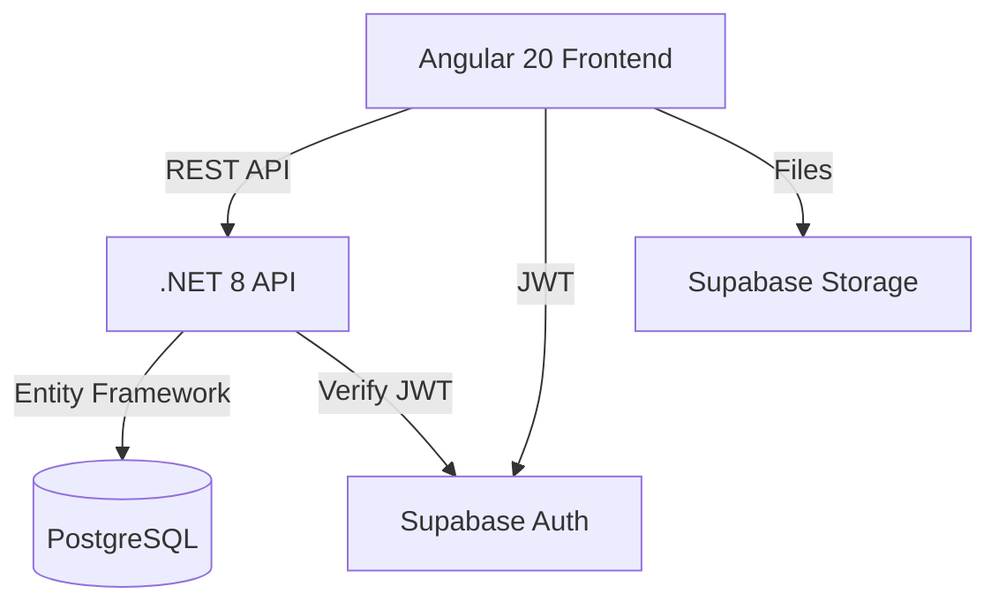

# SportPlanner - Especificación Técnica
Versión: 1.0.0
Fecha: 2025-01-24
Estado: Draft

## Resumen Ejecutivo
SportPlanner es una aplicación web SaaS para planificación deportiva que permite a entrenadores crear, gestionar y compartir planificaciones de entrenamientos con un sistema de marketplace integrado.

## Stakeholders
- Product Owner: Cliente
- Technical Lead: Equipo de desarrollo
- Development Team: Full-stack (Angular + .NET)

## Arquitectura del Sistema

### Stack Tecnológico
```yaml
Frontend:
  Framework: Angular 20
  Styling: Tailwind CSS v4
  Icons: Hero Icons
  State: Angular Signals
  Build: Vite/esbuild

Backend:
  Framework: .NET 8
  Architecture: Monolithic
  ORM: Entity Framework Core
  API: REST with OpenAPI
  Auth: JWT + Supabase

Database:
  Primary: PostgreSQL 15+ (Supabase)
  Auth: Supabase Auth
  Storage: Supabase Storage

Infrastructure:
  Hosting: TBD
  CI/CD: GitHub Actions
```

### Diagrama de Arquitectura


## Módulos Principales

1. **Autenticación y Suscripciones**
2. **Gestión de Equipos y Organizaciones**
3. **Planificaciones y Conceptos**
4. **Entrenamientos y Ejercicios**
5. **Marketplace de Planificaciones**
6. **Informes y Analytics**
7. **Vista Dinámica de Entrenamientos**

## Próximos Documentos
- `architecture.md` - Diseño detallado del sistema
- `data-models.md` - Esquemas de base de datos
- `api-spec.yaml` - Especificación OpenAPI
- `ui-components.md` - Componentes de frontend
- `test-cases.md` - Casos de prueba

---
**Estado**: Documento base creado
**Siguiente**: Definición de modelos de datos