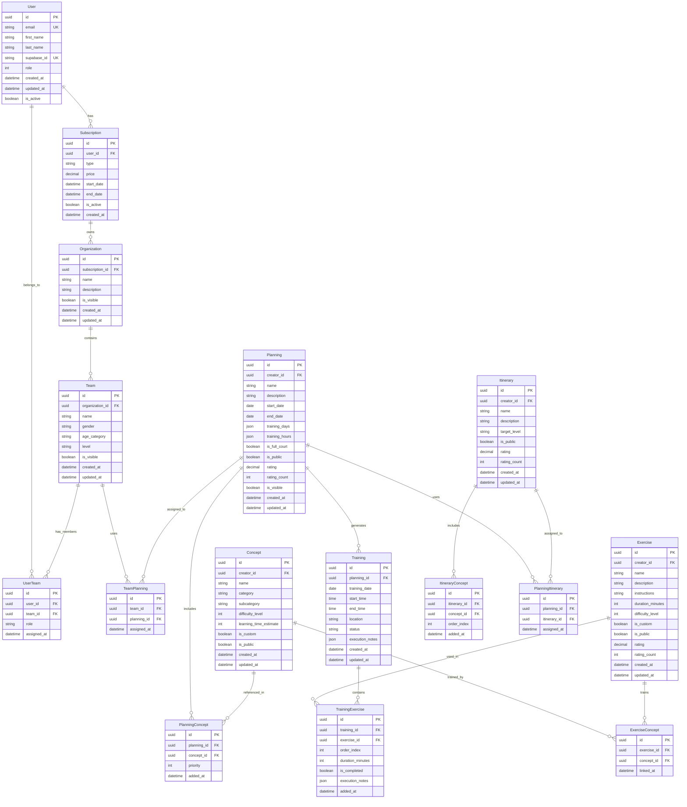

# SportPlanner - Modelos de Datos

## Diagrama de Entidad-Relación



## Definiciones de Entidades

### Tipos de Suscripción
```typescript
enum SubscriptionType {
  FREE = 'free',        // €0 - 1 equipo, 15 entrenamientos
  TRAINER = 'trainer',  // Acceso completo entrenador
  CLUB = 'club'         // Gestión múltiples equipos
}
```

### Roles de Usuario
```typescript
enum UserRole {
  Administrator = 0,
  Director = 1,
  Coach = 2,
  Member = 3
}
```

### Niveles de Equipo
```typescript
enum TeamLevel {
  A = 'A',  // Alto rendimiento
  B = 'B',  // Intermedio
  C = 'C'   // Iniciación
}
```

### Estados de Entrenamiento
```typescript
enum TrainingStatus {
  SCHEDULED = 'scheduled',
  IN_PROGRESS = 'in_progress',
  COMPLETED = 'completed',
  CANCELLED = 'cancelled'
}
```

## Reglas de Negocio en Base de Datos

### Constraints
1. **Suscripciones**: Un usuario puede tener máximo 1 suscripción activa no gratuita
2. **Equipos**: Limitados según tipo de suscripción
3. **Entrenamientos**: Limitados a 15 en suscripción gratuita
4. **Visibilidad**: Soft delete mediante campo `is_visible`

### Índices Recomendados
```sql
-- Performance crítico
CREATE INDEX idx_user_email ON users(email);
CREATE INDEX idx_subscription_user_active ON subscriptions(user_id, is_active);
CREATE INDEX idx_team_organization ON teams(organization_id);
CREATE INDEX idx_training_date ON trainings(training_date);
CREATE INDEX idx_planning_public_rating ON plannings(is_public, rating DESC);
```

### Triggers y Funciones
1. **Auto-generación entrenamientos**: Al asignar planificación a equipo
2. **Validación límites suscripción**: Antes de crear equipos/entrenamientos
3. **Actualización ratings**: Al recibir nuevas valoraciones
4. **Audit trail**: Registro de cambios en entidades críticas

---
**Estado**: Modelo completo definido
**Siguiente**: Especificación de API REST