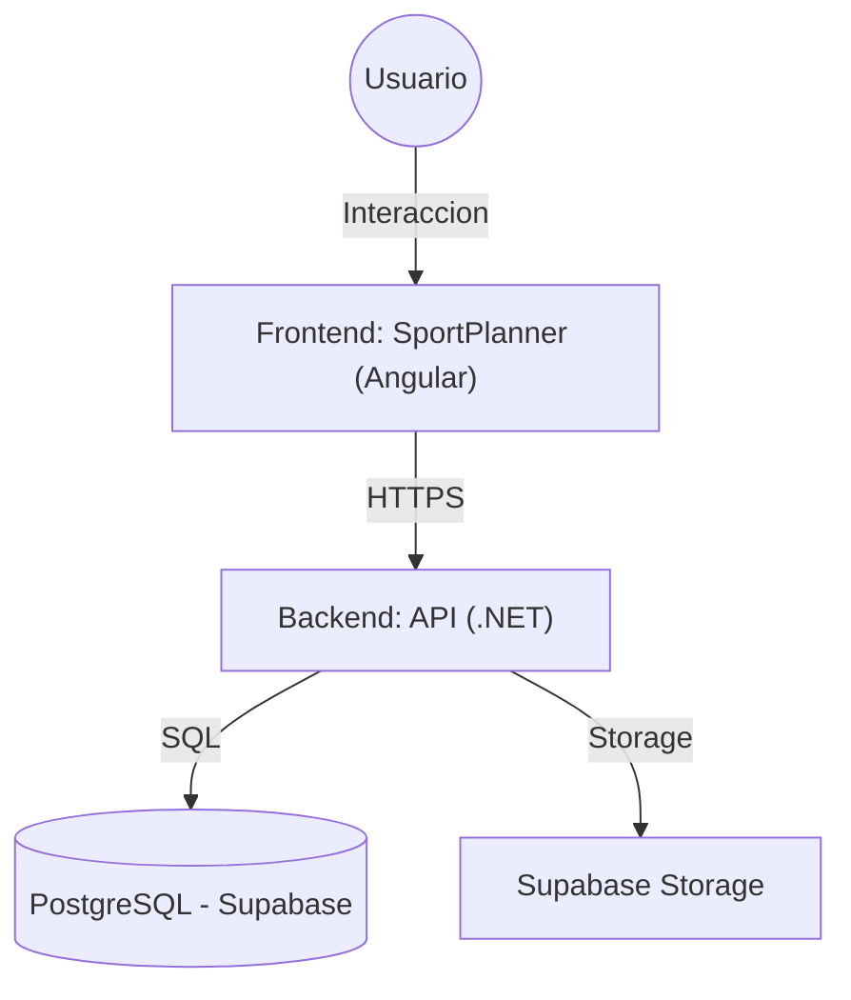
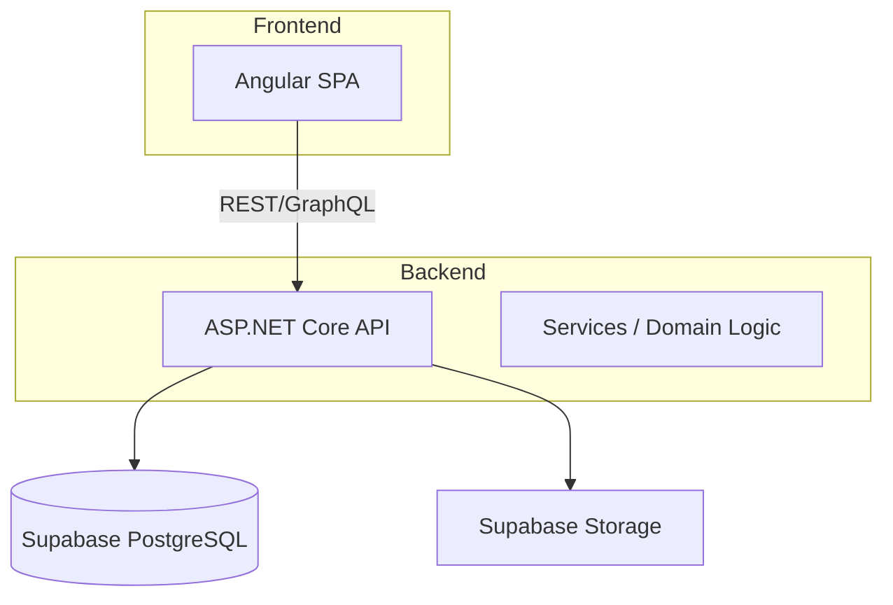

```markdown
# DIAGRAMAS DE ARQUITECTURA

---

## C4 - Context


## C4 - Contenedores


## Diagrama ER
Ver `docs/tecnico/ModeloDatos.md` para un ER completo (Mermaid incluido en ese archivo)

---
**Estado:** borrador — Exportar archivos de imagen en `diagrams/` y referenciarlos desde aquí
```
